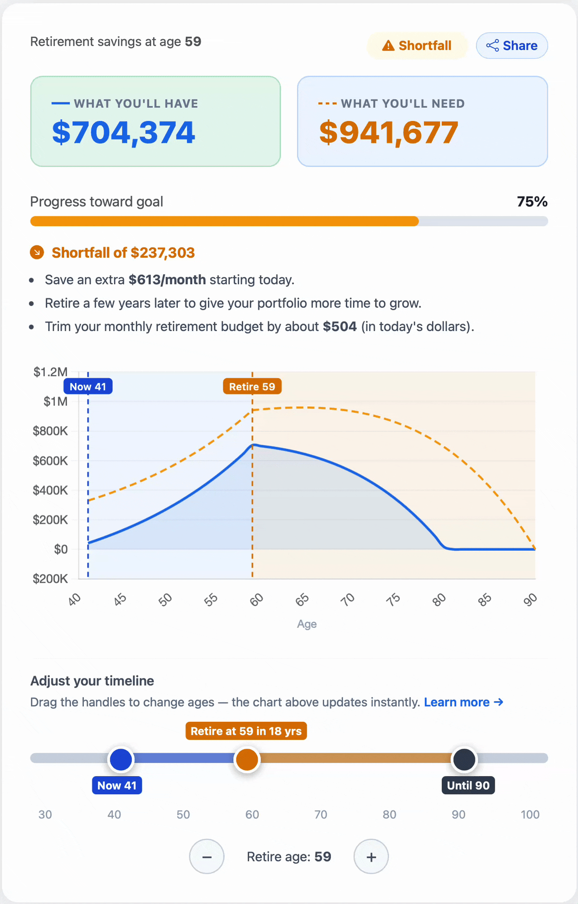

# FIRE Retirement Calculator

An interactive, single-page retirement calculator that helps you answer one question: **are you on track to retire early?**

Enter your income, savings, monthly contributions, and spending. The calculator models your portfolio growth through retirement and shows whether your money outlasts you — updated live as you type.

**[→ Find your FIRE number](https://apiarya.github.io/fire-calculator)**

Found a bug or have a question? [Open an issue](https://github.com/apiarya/fire-calculator/issues)

---

---

## Why this exists

Most FIRE calculators are either too simple (a single number) or too complex (spreadsheet hell). This one aims to be just right — grounded in real math, usable in 2 minutes, and honest about its assumptions.

## What it models

- Portfolio growth during accumulation (pre-retirement)
- Inflation-adjusted drawdown during retirement
- Social Security and other guaranteed income offsets
- Present value of an inflation-growing annuity for your exact retirement horizon (more conservative than the 4% rule for early retirees), with a live chart showing your trajectory
- Save multiple scenarios in-memory to compare side by side

## Tech

Pure HTML/CSS/JS. No framework, no build step, no server, no tracking. Everything in `index.html`. Hosted on GitHub Pages.

## Limitations

- No taxes modeled (accumulation or drawdown)
- No sequence-of-returns risk
- Social Security defaults to an SSA bend-point estimate based on income; you can override with your actual statement amount (not your full earnings record)
- Retirement and brokerage contributions are combined — no tax-treatment distinction between account types (401k pre-tax vs Roth vs taxable)

> Educational only — not financial advice.
